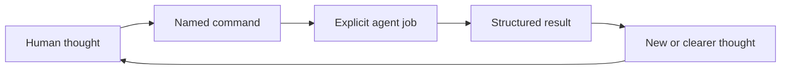

# Think It Through

**Think freely. The agent follows your lead.**

Think It Through is a lightweight command palette for developing ideas with AI across long, branching conversations.

Each command gives the agent one job and tells it what to work on by default, so you can write the thought and choose what happens next.

## Why commands

Ideas can arrive faster than you can package them. Attention jumps between threads; question batches break the flow. For some people with ADHD, stopping to reformat a thought creates friction.

You mix the thought with instructions:

> This could be a command palette, a deck, or a human-agent interface. Separate the ideas, preserve their differences, connect them, then respond.

The thought comes first. The rest directs the response.

Think It Through names the repeated instruction. You keep the thought's form; the agent adapts its next response. Without a command, it responds as usual.

## See it once

```text
Command palette, visual deck, human-agent UX. These ideas may connect.
/think-distill
```

The result:

```text
> 🎯 Latest message → 🧪 DISTILL

Distilled
- Command palette: the interface.
- Starter deck: its visual presentation.
- Human-agent UX: the wider problem.

Connections
The palette can use a deck presentation inside the wider UX.

Response
Lead with command palette. It says what the product does.
```

`think-distill` separated, clarified, connected only what belonged together, then responded. Each card defines a concrete response contract.

Think It Through adds a domain-neutral conversation control layer to your method.

## How it works

You supply ideas and judgment. A command states the next job. The agent clarifies, connects, questions, challenges, or reconstructs. The result feeds your next thought.



`Context` covers all relevant material. `Focus` is what the combo works on; narrowing it keeps the context.

Commands shape one response. Repeat, switch, or talk without one. Only `interview` and `grill` continue across turns.

## Start with six commands

I recommend these six starting points. They remain revisable.

### 🧪 [`/think-distill`](plugins/think-it-through/skills/think-distill/SKILL.md)

Messy thoughts. Latest message. `separate → clarify → connect when supported`

### 💬 [`/think-discuss`](plugins/think-it-through/skills/think-discuss/SKILL.md)

Open exploration. Current thought. `recover → develop → keep open`

### 🔎 [`/think-interview`](plugins/think-it-through/skills/think-interview/SKILL.md)

Missing context. Smallest unclear subject. `research → ask → integrate → repeat`

### 🔥 [`/think-grill`](plugins/think-it-through/skills/think-grill/SKILL.md)

A proposal needs pressure. Current testable idea. `map → recommend → question → repeat`

### 🗺️ [`/think-recap`](plugins/think-it-through/skills/think-recap/SKILL.md)

The conversation has lost its shape. Available conversation. `recover → map → synthesize`

### 🧭 [`/think-propose`](plugins/think-it-through/skills/think-propose/SKILL.md)

An open decision needs direction. Current question. `evaluate → choose → expose tradeoff`

## Keep, resume, or act

```text
latest message         → DISTILL → clear threads
available conversation → RECAP   → navigable map
conversation or result → BRIEF   → portable checkpoint
accepted direction     → PLAN    → execution plan
```

The agent uses this conversation map:

```text
Conversation
└── Topics
    └── Axes
        ├── ideas and assumptions
        ├── proposals and decisions
        ├── tensions and contradictions
        └── open questions
```

`/think-recap` creates a conversational checkpoint. `/think-to-brief` creates a portable snapshot. `/think-to-plan` creates operational structure without authorizing execution.

A new session resumes from a brief or content you provide. There is no hidden memory or synchronization.

## Install

This README uses portable notation. Provider syntax differs:

| Portable | Codex | Claude Code |
| --- | --- | --- |
| `/think-recap` | `$think-it-through:think-recap` | `/think-it-through:think-recap` |

### Codex

```bash
codex plugin marketplace add thevzion/think-it-through
codex plugin add think-it-through@think-it-through
```

### Claude Code

```bash
claude plugin marketplace add thevzion/think-it-through --scope user
claude plugin install think-it-through@think-it-through --scope user
```

## Build a combo

Each card declares what it applies to by default:

```text
/think-recap

🎯 Available conversation → 🗺️ RECAP
└── applies by default
```

An explicit selector changes that focus:

```text
/think-on-axis "Artifacts" + /think-recap

🎯 Axis: Artifacts → 🗺️ RECAP
└── selector changed the focus
```

`/think-recap` shares this focus with `/think-on-conversation + /think-recap`. Standalone `/think-to-brief` has the same equivalence; a combo result takes priority.

Defaults resolve the omitted focus directly. They do not invoke hidden cards. When an existing selector expresses the exact same focus, the card names that explicit equivalent. Modifiers remain explicit.

Natural language translates into existing commands:

```text
Intent
“On Positioning, clarify the discussion, propose a direction,
create a brief, and add a diagram.”

Commands
/think-on-topic "Positioning"
+ /think-distill
+ /think-propose
+ /think-to-brief
+ /think-with-diagrams

Resolved trace
🎯 Topic: Positioning → 🧪 DISTILL → 🧭 PROPOSE → 📄 BRIEF + 📊 DIAGRAMS
└── focus              └── job      └── job       └── artifact └── modifier
```

The typed pipeline is:

```text
SESSION                         standalone
SELECTOR? → JOB* → OUTPUT? → MODIFIER*
```

Card type sets order. Jobs pass results left to right; one selector and output are allowed. Modifiers read the same final result. Conflicts require clarification.

Read the combo as a high-level query over a generative engine. Use the available conversation as working state. The selector chooses what to work on, and jobs name transformations. Outputs create artifacts; modifiers change their representation. The query makes the operation explicit; the content remains generative.

## Full command reference

| Command | Type | Applies to by default | Result | Runs for |
| --- | --- | --- | --- | --- |
| [🧩 `/think-it-through`](plugins/think-it-through/skills/think-it-through/SKILL.md) | Session | Current focus | Session map | Session |
| [🧪 `/think-distill`](plugins/think-it-through/skills/think-distill/SKILL.md) | Job | Latest message | Clarified thoughts | One response |
| [💬 `/think-discuss`](plugins/think-it-through/skills/think-discuss/SKILL.md) | Job | Current thought | Open exploration | One response |
| [🔎 `/think-interview`](plugins/think-it-through/skills/think-interview/SKILL.md) | Job | Unclear subject | Shared understanding | Multi-turn |
| [🔥 `/think-grill`](plugins/think-it-through/skills/think-grill/SKILL.md) | Job | Testable idea | Verdict or risks | Multi-turn |
| [🗺️ `/think-recap`](plugins/think-it-through/skills/think-recap/SKILL.md) | Job | Available conversation | Map and synthesis | One response |
| [🧭 `/think-propose`](plugins/think-it-through/skills/think-propose/SKILL.md) | Job | Open question | Strong direction | One response |
| [⚡ `/think-next`](plugins/think-it-through/skills/think-next/SKILL.md) | Job | Actionable result | Next actions | One response |
| [🎯 `/think-on-conversation`](plugins/think-it-through/skills/think-on-conversation/SKILL.md) | Selector | Conversation | Focus | One combo |
| [🎯 `/think-on-topic`](plugins/think-it-through/skills/think-on-topic/SKILL.md) | Selector | Topic | Focus | One combo |
| [🎯 `/think-on-axis`](plugins/think-it-through/skills/think-on-axis/SKILL.md) | Selector | Axis | Focus | One combo |
| [📄 `/think-to-brief`](plugins/think-it-through/skills/think-to-brief/SKILL.md) | Output | Conversation or final result | Thinking Brief | One output |
| [📋 `/think-to-plan`](plugins/think-it-through/skills/think-to-plan/SKILL.md) | Output | Executable direction | Execution Plan | One output |
| [📊 `/think-with-diagrams`](plugins/think-it-through/skills/think-with-diagrams/SKILL.md) | Modifier | Final result | Diagram | One response |
| [🧠 `/think-with-reasoning-map`](plugins/think-it-through/skills/think-with-reasoning-map/SKILL.md) | Modifier | Final reasoning | Reasoning map | One response |

## Fit it to your stack

Use it with [Superpowers](https://github.com/obra/superpowers), [Ponytail](https://github.com/DietrichGebert/ponytail), [Stop Slop](https://github.com/hardikpandya/stop-slop), and your templates. [Compound Engineering](https://github.com/EveryInc/compound-engineering-plugin) and [Compound Knowledge](https://github.com/EveryInc/compound-knowledge-plugin) preserve learning across later cycles.

## Make a command from something you keep repeating

`/think-distill` began as: “Separate these thoughts, clarify each, show supported connections, then respond.”

```text
repeated instruction
→ define one job and what it applies to by default
→ define result and limits
→ test across subjects
→ keep, revise, merge, or remove
```

```text
Context → Use when → Applies to by default → Job → Result
→ Runs for → Limits → Combines with → Flow → Format
```

Keep domain cards in your stack. [Open an issue](https://github.com/thevzion/think-it-through/issues) for obstructive defaults, overlaps, or missing instructions.

## Origin and license

Grill Me supplied the seed: a short name for a reusable response contract. Think It Through extends that pattern across complex conversations.

License: [MIT](LICENSE).
