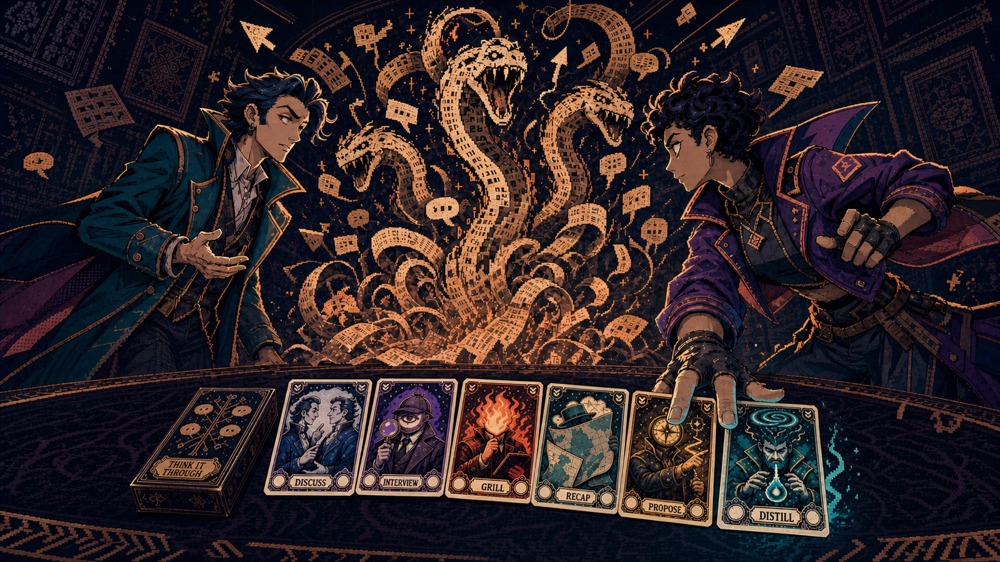
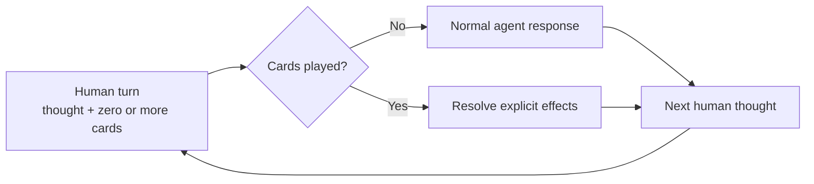

# Think It Through

**Stop rewriting the same instructions. Play a card.**

Think It Through is an open-source deck of conversation cards for directing an
agent while you work through an idea. Talk normally, then use a short command
when you want the next response to clarify, explore, question, challenge,
recover, or preserve your thinking.

It is built on the
[Human-Agent Card Protocol](https://github.com/thevzion/human-agent-card-protocol),
which gives cards shared rules for composition and lifecycle.



## The problem

You know what the agent should do next, but expressing it takes another
paragraph:

> Separate the ideas first. Clarify each one without merging them. Then show
> only the relationships supported by what I said, and respond.

That instruction works. It also interrupts the thought and gets rewritten in
slightly different words every time.

A card turns the repeated instruction into a visible contract:

```text
/think-distill
```

Use cards to:

- replace repeated meta-instructions with short commands;
- redirect a confused response without restarting the conversation;
- recover the structure of a long discussion;
- combine operations, such as `RECAP + DIAGRAMS`;
- keep the human in charge of direction and judgment;
- create a brief or plan only when explicitly requested.

No card is required. Ordinary conversation stays ordinary.

## See one complete exchange

**Human**

```text
The product may be a method, an interface, and a protocol. Some of those
ideas overlap, but perhaps I am forcing them together.

/think-distill
```

**Agent**

> 🎯 **Latest message** → 🧪 **DISTILL**

**Distilled**

- As a method, the product is a repeatable way of working.
- As an interface, it is how a person directs and observes the work.
- As a protocol, it is a set of rules that different implementations can
  follow.

**Connections**

The three ideas can describe layers of one system, but the thought does not yet
show that they must be one product. A method can prescribe a way of working
while a protocol stays neutral about the method.

**Response**

Decide which layer people adopt first. The other two can support it without
needing the same product boundary.

**Useful next thought**

> The interface is what people adopt. The method can stay optional, and the
> protocol can sit underneath both.

The card did more than label the turn. It separated the claims, preserved the
tension, and returned clearer material for the next exchange.

## Install

### Codex

```bash
codex plugin marketplace add thevzion/think-it-through
codex plugin add think-it-through@think-it-through
```

Use `$think-it-through:think-help` or play
`$think-it-through:think-distill`.

### Claude Code

```bash
claude plugin marketplace add thevzion/think-it-through --scope user
claude plugin install think-it-through@think-it-through --scope user
```

Use `/think-it-through:think-help` or play
`/think-it-through:think-distill`.

The examples below use the portable shorthand `/think-*`.

## Start with six cards

These six cover the main loop from a rough thought to a tested direction. They
came from instructions I kept repeating, not from a claim that every thinking
process needs the same primitives.

- [🧪 `/think-distill`](plugins/think-it-through/skills/think-distill/SKILL.md)
  separates and clarifies thoughts, then exposes supported relationships.
- [💬 `/think-discuss`](plugins/think-it-through/skills/think-discuss/SKILL.md)
  develops the current thought without forcing a conclusion.
- [🔎 `/think-interview`](plugins/think-it-through/skills/think-interview/SKILL.md)
  resolves missing understanding through one focused question at a time.
- [🔥 `/think-grill`](plugins/think-it-through/skills/think-grill/SKILL.md)
  pressure-tests one branch with a recommendation and question on each
  exchange.
- [🗺️ `/think-recap`](plugins/think-it-through/skills/think-recap/SKILL.md)
  recovers the conversation as a navigable map and synthesis.
- [🧭 `/think-propose`](plugins/think-it-through/skills/think-propose/SKILL.md)
  offers one direction with its decisive tradeoff and main risk.

Repeat a card, switch cards, or return to normal conversation as the thought
changes.

## Add control when you need it

The six core cards are enough to begin. The rest of the deck adds control
without making it part of every exchange.

### Ask the deck

`/think-help` explains a card or recommends normal conversation, one card, or a
combo:

```text
/think-help
/think-help distill
/think-help "I need to choose a direction"
```

Help gives exact commands but never plays them. `/think-next` recommends
actions inside your subject.

### Recover a long conversation

Think It Through maps available context as:

```text
Conversation
└── Topics
    └── Axes
        ├── ideas and assumptions
        ├── proposals and decisions
        ├── tensions and contradictions
        └── open questions
```

`/think-recap` rebuilds that map from the context available to the agent and
gives topics and axes reusable labels. It does not claim hidden or persistent
memory.

### Combine cards

Cards compose from left to right:

```text
/think-recap + /think-with-diagrams
```

```text
🎯 Conversation → 🗺️ RECAP + 📊 DIAGRAMS
```

Use a focus card when a default is too broad:

```text
/think-on-topic "Positioning"
+ /think-distill
+ /think-propose
+ /think-to-brief
+ /think-with-diagrams
```

```text
🎯 Topic: Positioning → 🧪 DISTILL → 🧭 PROPOSE → 📄 BRIEF + 📊 DIAGRAMS
```

HACP resolves `FOCUS? → MOVE* → OUTPUT? → MODIFIER*`. Moves pass results from
left to right. One output may create an artifact. Modifiers change its
representation, not its substance.

### Preserve or plan on demand

`/think-to-brief` creates a portable Markdown checkpoint. `/think-to-plan`
turns an accepted or explicitly provisional direction into a plan for review.
Neither command runs silently, and a plan does not authorize execution.

## Works with your methods and tools

Think It Through controls the requested shape of an agent response. It does not
replace the method, constraints, or tools that govern the work.

| Layer | Examples | What it contributes |
| --- | --- | --- |
| Conversation deck | Think It Through | The explicit operation for the next response |
| Interaction protocol | HACP | Composition, focus, duration, and clearing rules |
| Methods and constraints | Superpowers, Ponytail, Stop Slop | Process and quality rules |
| Capabilities | Skills, MCP servers, CLIs | Actions and access to external systems |

These layers can be used together because they answer different questions. The
examples name independent projects and tool categories; they do not imply a
native integration, affiliation, or endorsement.

## How cards play

A **human turn** supplies a thought and zero or more cards. An **agent turn**
resolves their effects. Together they form an **exchange**.



Most cards last one agent turn. `INTERVIEW` and `GRILL` span exchanges. Focus
cards last one combo, outputs last through creation, and modifiers affect one
representation.

Every play stays explicit. A cleared card never repeats from cadence alone, and
no move card plays silently.

## Card reference

[🧩 `/think-it-through`](plugins/think-it-through/skills/think-it-through/SKILL.md)
initializes the shared deck model.
[🧩 `/think-help`](plugins/think-it-through/skills/think-help/SKILL.md) explains
the deck. Neither is a card.

### Move cards

| Card | Play when | Default focus | Result | Duration |
| --- | --- | --- | --- | --- |
| [🧪 Distill](plugins/think-it-through/skills/think-distill/SKILL.md) | Thoughts need structure | Latest human message | Clear thoughts | One agent turn |
| [💬 Discuss](plugins/think-it-through/skills/think-discuss/SKILL.md) | Exploration should stay open | Current thought | Developed thought | One agent turn |
| [🔎 Interview](plugins/think-it-through/skills/think-interview/SKILL.md) | Understanding is missing | Smallest unclear subject | Shared understanding | Multiple exchanges |
| [🔥 Grill](plugins/think-it-through/skills/think-grill/SKILL.md) | An idea needs pressure | Current testable idea | Verdict and risks | Multiple exchanges |
| [🗺️ Recap](plugins/think-it-through/skills/think-recap/SKILL.md) | Orientation is lost | Available conversation | Map and synthesis | One agent turn |
| [🧭 Propose](plugins/think-it-through/skills/think-propose/SKILL.md) | An open question needs direction | Current open decision | One proposal | One agent turn |
| [⚡ Next](plugins/think-it-through/skills/think-next/SKILL.md) | Action should follow | Latest actionable result | One to three actions | One agent turn |

### Focus cards

| Card | Chooses | Duration |
| --- | --- | --- |
| [🎯 Conversation](plugins/think-it-through/skills/think-on-conversation/SKILL.md) | All available topics and axes | One combo |
| [🎯 Topic](plugins/think-it-through/skills/think-on-topic/SKILL.md) | One topic | One combo |
| [🎯 Axis](plugins/think-it-through/skills/think-on-axis/SKILL.md) | One axis | One combo |

### Output cards

| Card | Creates | Default focus |
| --- | --- | --- |
| [📄 Brief](plugins/think-it-through/skills/think-to-brief/SKILL.md) | Portable thinking checkpoint | Available conversation |
| [📋 Plan](plugins/think-it-through/skills/think-to-plan/SKILL.md) | Execution plan for review | Accepted or provisional direction |

### Modifier cards

| Card | Adds | Default focus |
| --- | --- | --- |
| [📊 Diagrams](plugins/think-it-through/skills/think-with-diagrams/SKILL.md) | Smallest useful visual | Final or latest useful result |
| [🧠 Reasoning map](plugins/think-it-through/skills/think-with-reasoning-map/SKILL.md) | Supported reasoning structure | Final reasoning or current decision |

## Build your own card

[HACP](https://github.com/thevzion/human-agent-card-protocol) separates shared
interaction rules from a deck. Start with an instruction you repeat:

```text
repeated instruction
→ define one effect and default focus
→ define result, duration, and limits
→ test across subjects
→ keep, revise, merge, or remove
```

The card contract is:

```text
Use when → Default focus → Effect → Result
→ Duration → Limits → Flow → Format
```

A different deck can define another purpose, mental model, and card set on the
same interaction rules.

Which instruction do you repeat often enough to turn into a card?
[Open an issue](https://github.com/thevzion/think-it-through/issues) to share
one, challenge a default, flag an overlap, or suggest a missing effect.

## Origin and license

Grill Me was the seed: one short command for one reusable conversation
contract. Think It Through extracted more repeated instructions into cards. I
derived the HACP draft from this first implementation; one deck cannot prove a
universal standard.

Think It Through is available under the [MIT License](LICENSE).
