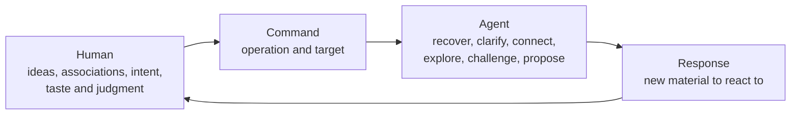

# Think It Through

**Think freely. The agent follows your lead.**

Develop complex ideas with AI without losing control of the conversation.

Think It Through is a lightweight, domain-neutral conversation control layer for human thinking. Each command gives the agent one job and a useful default target.

Talk as usual. Add a command when you need a specific kind of help. You keep your workflow.

## Why commands

You jump between fragments, revisions, and decisions before packaging each thought into a prompt.

You often append instructions for the next response:

> Clarify each idea. Keep unrelated ideas apart. Show supported connections, then respond.

Bring the thought in the form it arrives. The command tells the agent how to work with it next. You choose the command. The agent changes modes when asked.

Fast thoughts, shifting attention, and question batches can create friction, including for some people with ADHD. Without a command, the agent responds as usual.

## See it once

**Without a named command**

> This may be a command palette, a visual deck, or a human-agent UX layer. Separate the ideas, connect them, then respond.

**With a named command**

> Command palette, visual deck, human-agent UX. These ideas may connect.
>
> `/think-distill`

> 🎯 **Latest message** → 🧪 **DISTILL**
>
> **Distilled**
>
> - Command palette: human interface.
> - Starter deck: visual form.
>
> **Connections**
>
> The palette can use a deck presentation.
>
> **Response**
>
> Lead with command palette.

`think-distill` structures the message without erasing distinctions.

## How it works

You bring ideas, intent, taste, and judgment. A command names one operation. The agent follows your lead as it connects, reconstructs, or proposes. You decide what to keep.



The command governs one operation. You control the wider process and choose the next command.

## Start with six commands

These are the six commands I currently consider generic enough to recommend first. They grew from my conversations and remain open to revision. `interview` and `grill` continue after one invocation.

Try them in real conversations, then [open an issue](https://github.com/thevzion/think-it-through/issues) with what held up, overlapped, or went missing.

### 🧪 [`/think-distill`](plugins/think-it-through/skills/think-distill/SKILL.md)

**When:** messy ideas. **Default:** latest message.

`separate → clarify → connect when supported`

**Result:** clarified thoughts and a response.

### 💬 [`/think-discuss`](plugins/think-it-through/skills/think-discuss/SKILL.md)

**When:** open exploration. **Default:** current thought.

`recover context → explore → keep open`

**Result:** deeper exploration.

### 🔎 [`/think-interview`](plugins/think-it-through/skills/think-interview/SKILL.md)

**When:** the agent lacks context. **Default:** smallest material gap.

`find gap → ask → integrate → repeat`

**Result:** shared understanding.

### 🔥 [`/think-grill`](plugins/think-it-through/skills/think-grill/SKILL.md)

**When:** an idea needs pressure. **Default:** current testable idea.

`map branches → recommend → question → repeat`

**Result:** verdict or explicit risks.

### 🗺️ [`/think-recap`](plugins/think-it-through/skills/think-recap/SKILL.md)

**When:** the conversation loses shape. **Default:** full available conversation.

`recover topics and axes → map → digest`

**Result:** navigable map and digest.

### 🧭 [`/think-propose`](plugins/think-it-through/skills/think-propose/SKILL.md)

**When:** you need direction. **Default:** open question or decision.

`evaluate → choose → expose tradeoff`

**Result:** proposal, tradeoff, and risk.

## Recover, choose, continue

Think It Through gives the agent a generic mental model:

```text
Conversation
└── Topics
    └── Axes
        ├── ideas and assumptions
        ├── proposals and decisions
        ├── tensions and contradictions
        └── open questions
```

This default conversation map captures the discussion's shape. Domain methods enrich its contents: product work can add users and hypotheses; architecture can add constraints and risks; research or creative work can add evidence, themes, and directions. Recaps, selectors, and briefs share the topology. Axes may be active, paused, resolved, or superseded.

`/think-it-through` adopts the available context and maintains a best-effort map. `/think-recap` exposes it with human labels. `think-on-*` targets the conversation, a topic, or an axis. `think-to-brief` preserves a snapshot.

> Distill the message. Recover the session. Preserve what matters.

```text
/think-on-axis "Command defaults" + /think-discuss
```

The map uses the context still available and any checkpoint you provide. It cannot recover discarded context or create memory between sessions.

## Install

This README uses portable `/think-*` notation. Codex and Claude Code add different prefixes:

| Portable | Codex | Claude Code |
| --- | --- | --- |
| `/think-recap` | `$think-it-through:think-recap` | `/think-it-through:think-recap` |

### Codex

```bash
codex plugin marketplace add thevzion/think-it-through
codex plugin add think-it-through@think-it-through
```

### Claude Code

```bash
claude plugin marketplace add thevzion/think-it-through --scope user
claude plugin install think-it-through@think-it-through --scope user
```

## More control when you need it

```text
Talk as usual.
Add one command when you need a specific kind of help.
Add another card to change the target, representation,
destination, or next operation.
```

Defaults supply the usual target, display, and cadence. Commands use relevant evidence from the full conversation.

The composition grammar is:

```text
optional ON → one or more MOVES → optional TO + zero or more WITH
```

- `think-on-*` binds a target to the combo, then expires.
- Moves chain through their results.
- `think-with-*` enriches the final representation; `think-to-*` creates an artifact.

Selectors never remove evidence. `interview` and `grill` retain their target until completion. Conflicting controls require clarification.

```text
/think-distill + /think-propose

/think-on-topic Architecture + /think-recap + /think-with-diagrams

/think-on-conversation + /think-to-brief
```

`think-recap` stays in the conversation. `think-to-brief` creates a snapshot. `think-to-plan` creates an execution plan without authorizing execution.

## Full command reference

I use the remaining cards too, but treat them as optional session, scope, representation, and artifact controls rather than candidate fundamentals.

| Command | Default target | Result | Cadence |
| --- | --- | --- | --- |
| [🧩 `/think-it-through`](plugins/think-it-through/skills/think-it-through/SKILL.md) | Current focus or supplied subject | Adopted session map | Session activation |
| [🧪 `/think-distill`](plugins/think-it-through/skills/think-distill/SKILL.md) | Latest human message | Clarified thoughts | One-shot |
| [💬 `/think-discuss`](plugins/think-it-through/skills/think-discuss/SKILL.md) | Current thought | Open exploration | One-shot |
| [🔎 `/think-interview`](plugins/think-it-through/skills/think-interview/SKILL.md) | Smallest material gap | Shared understanding | Multi-turn |
| [🔥 `/think-grill`](plugins/think-it-through/skills/think-grill/SKILL.md) | Current testable idea | Verdict or explicit risks | Multi-turn |
| [🗺️ `/think-recap`](plugins/think-it-through/skills/think-recap/SKILL.md) | Available conversation | Map and digest | One-shot |
| [🧭 `/think-propose`](plugins/think-it-through/skills/think-propose/SKILL.md) | Open question or decision | One strong direction | One-shot |
| [⚡ `/think-next`](plugins/think-it-through/skills/think-next/SKILL.md) | Latest actionable result or focus | One to three actions | One-shot |
| [🎯 `/think-on-conversation`](plugins/think-it-through/skills/think-on-conversation/SKILL.md) | Available conversation | Conversation target | One-shot selector |
| [🎯 `/think-on-topic`](plugins/think-it-through/skills/think-on-topic/SKILL.md) | Named or current topic | Topic target | One-shot selector |
| [🎯 `/think-on-axis`](plugins/think-it-through/skills/think-on-axis/SKILL.md) | Named or current axis | Axis target | One-shot selector |
| [📊 `/think-with-diagrams`](plugins/think-it-through/skills/think-with-diagrams/SKILL.md) | Current or co-invoked result | Useful diagram | One-shot modifier |
| [🧠 `/think-with-reasoning-map`](plugins/think-it-through/skills/think-with-reasoning-map/SKILL.md) | Current or co-invoked reasoning | Reasoning map | One-shot modifier |
| [📄 `/think-to-brief`](plugins/think-it-through/skills/think-to-brief/SKILL.md) | Conversation or selected result | Thinking Brief | Artifact projection |
| [📋 `/think-to-plan`](plugins/think-it-through/skills/think-to-plan/SKILL.md) | Accepted or provisional direction | Execution Plan | Artifact projection |

## Fit it to your stack

| Layer | Example | Contribution |
| --- | --- | --- |
| Conversation control | Think It Through | Chooses the next semantic operation |
| Development method | [Superpowers](https://github.com/obra/superpowers) | Brainstorming, planning, TDD, and delivery |
| Engineering constraint | [Ponytail](https://github.com/DietrichGebert/ponytail) | YAGNI and minimal implementation |
| Writing constraint | [Stop Slop](https://github.com/hardikpandya/stop-slop) | Removes recurring AI writing patterns |

Think It Through governs one response. Your method can remain loose or impose stages and quality criteria. Domain skills provide knowledge; templates shape artifacts.

## Related patterns

[Compound Engineering](https://github.com/EveryInc/compound-engineering-plugin) preserves engineering learnings between production cycles. [Compound Knowledge](https://github.com/EveryInc/compound-knowledge-plugin) applies compounding to knowledge work. Think It Through focuses on conversations and their artifacts.

## Evolve the deck

Cards start with an instruction you keep rewriting:

```text
repeated instruction
→ define one move
→ choose a useful default
→ define result and boundary
→ test across subjects
→ keep, revise, merge, or remove
```

Shared cards recur across subjects, produce distinct results, and compose. Personal, team, and domain cards reuse the grammar elsewhere.

```text
When → On (default) → Move → Result → Cadence → Boundary
     → Composition → Flow → Display
```

[Open an issue](https://github.com/thevzion/think-it-through/issues) when a default fights your workflow, cards overlap, or a recurring instruction has no card.

## Origin and license

Grill Me supplied the seed: a short name for a reusable response contract. Think It Through extends the pattern across complex conversations.

License: [MIT](LICENSE).
