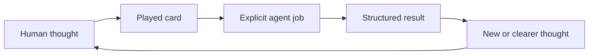

# Think It Through

**Think freely. The agent follows your lead.**

A lightweight command deck for developing complex ideas with AI.

Start with the thought. Play a card when you want the agent to clarify, explore, challenge, recover, or preserve it.

Each command invokes a self-describing card: a reusable contract for the agent's focus, job, and result.

## Why commands

Ideas can arrive faster than you can package them. Attention jumps between branches, and batches of questions break the flow. For some people with ADHD, stopping to reformat a thought creates friction.

State the thought as it arrives. Each card gives the agent one clear job and a useful default. Spend less attention instructing the agent and more attention developing the thought.

Without a card, the agent responds.

## See it once

```text
The product might be a method, a set of helpers, and a shared protocol.
Those ideas overlap, but I do not want to collapse them.
/think-distill
```

```text
> 🎯 Latest message → 🧪 DISTILL

Distilled
- Method: the approach a person follows.
- Helpers: operations used during a conversation.
- Protocol: the rules that make those operations coherent.

Connections
A protocol can define helpers without prescribing a method.

Response
Lead with the helpers. Introduce the protocol after the first example.
```

```text
Talk
→ play one card
→ repeat or switch cards
→ build a combo when more control becomes useful
```

```text
/think-distill → command
🧪 DISTILL     → card
```

## How it works

You supply ideas and judgment. A card names the agent's next job. Its result feeds your next thought.



Cards share four concepts:

- `Context`: the relevant conversation and supplied material.
- `Focus`: what a combo works on without discarding useful context.
- `Conversation → Topics → Axes`: the canonical navigation model, reconstructed as context allows.
- `SELECTOR? → JOB* → OUTPUT? → MODIFIER*`: combo order.

Think It Through controls how the agent works with the thought next. Your method, domain skills, and templates control the substance, standards, and artifact structure.

Any card loads the protocol. Use [`/think-it-through`](plugins/think-it-through/skills/think-it-through/SKILL.md) alone to initialize it on the available conversation.

## Start with six cards

I extracted these six cards from my conversations and recommend them first: clarify, explore, understand, challenge, recover, and choose. Treat them as a starting point. Use will change the selection.

### 🧪 [`/think-distill`](plugins/think-it-through/skills/think-distill/SKILL.md)

Messy thoughts. Latest message. `separate → clarify → connect when supported`

### 💬 [`/think-discuss`](plugins/think-it-through/skills/think-discuss/SKILL.md)

Open exploration. Current thought. `recover → develop → keep open`

### 🔎 [`/think-interview`](plugins/think-it-through/skills/think-interview/SKILL.md)

Missing context. Smallest unclear subject. `research → ask → integrate → repeat`

### 🔥 [`/think-grill`](plugins/think-it-through/skills/think-grill/SKILL.md)

A proposal needs pressure. Current testable idea. `map → recommend → question → repeat`

### 🗺️ [`/think-recap`](plugins/think-it-through/skills/think-recap/SKILL.md)

The conversation has lost its shape. Available conversation. `recover → map → synthesize`

### 🧭 [`/think-propose`](plugins/think-it-through/skills/think-propose/SKILL.md)

An open decision needs direction. Current question. `evaluate → choose → expose tradeoff`

## Keep, resume, or act

```text
latest message         → DISTILL → clear thoughts
available conversation → RECAP   → navigable map
conversation or result → BRIEF   → portable checkpoint
accepted direction     → PLAN    → execution plan
```

Cards share one navigation model:

```text
Conversation
└── Topics
    └── Axes
        ├── ideas and assumptions
        ├── proposals and decisions
        ├── tensions and contradictions
        └── open questions
```

```text
Conversation → Topics → Axes
              ↓
cards recover and transform the selected material
              ↓
domain-native response, brief, or plan
```

Short labels mark axes as active, paused, resolved, or replaced. `/think-recap` displays the map; selectors navigate it. The map can use only available context and checkpoints you provide.

Traces stay in chat. A brief preserves a portable snapshot in the subject's language. A plan follows project conventions and never authorizes execution. A new session resumes from context you supply.

## Install

This README uses portable notation. Provider syntax differs:

| Portable | Codex | Claude Code |
| --- | --- | --- |
| `/think-recap` | `$think-it-through:think-recap` | `/think-it-through:think-recap` |

### Codex

```bash
codex plugin marketplace add thevzion/think-it-through
codex plugin add think-it-through@think-it-through
```

### Claude Code

```bash
claude plugin marketplace add thevzion/think-it-through --scope user
claude plugin install think-it-through@think-it-through --scope user
```

## Build a combo

Type a command to play a card. Combine commands to play a combo.

Cards have defaults:

```text
/think-recap

🎯 Available conversation → 🗺️ RECAP
└── applies by default
```

A selector overrides one combo:

```text
/think-on-axis "Artifacts" + /think-recap

🎯 Axis: Artifacts → 🗺️ RECAP
└── selector changed the focus
```

Defaults play no hidden cards. `/think-recap` equals `/think-on-conversation + /think-recap`. Standalone `/think-to-brief` uses the same focus unless a job supplies its result.

```text
Intent
“For Positioning, distill, propose, brief, and diagram.”

Commands
/think-on-topic "Positioning"
+ /think-distill
+ /think-propose
+ /think-to-brief
+ /think-with-diagrams

Resolved trace
🎯 Topic: Positioning → 🧪 DISTILL → 🧭 PROPOSE → 📄 BRIEF + 📊 DIAGRAMS
└── focus              └── job      └── job       └── artifact └── modifier
```

Jobs pass results left to right. A selector sets focus, an output creates an artifact, and modifiers format the final result. Conflicts require clarification.

A combo acts like a semantic query over a generative engine: it fixes the operation while the engine generates the content.

## The current deck

These 14 cards form my current working deck. Each began as a repeated instruction. Use will decide which cards remain, change, merge, or leave.

### Job cards

| Card | Play when | Works on by default | Result | Stays in play |
| --- | --- | --- | --- | --- |
| [🧪 `/think-distill`](plugins/think-it-through/skills/think-distill/SKILL.md) | Thoughts arrive tangled | Latest message | Clear thoughts | Once |
| [💬 `/think-discuss`](plugins/think-it-through/skills/think-discuss/SKILL.md) | You want to explore | Current thought | Developed thought | Once |
| [🔎 `/think-interview`](plugins/think-it-through/skills/think-interview/SKILL.md) | Context is missing | Unclear subject | Shared understanding | Multi-turn |
| [🔥 `/think-grill`](plugins/think-it-through/skills/think-grill/SKILL.md) | An idea needs pressure | Testable idea | Verdict or risks | Multi-turn |
| [🗺️ `/think-recap`](plugins/think-it-through/skills/think-recap/SKILL.md) | You lost the shape | Conversation | Map and synthesis | Once |
| [🧭 `/think-propose`](plugins/think-it-through/skills/think-propose/SKILL.md) | A question needs direction | Open question | Direction and tradeoff | Once |
| [⚡ `/think-next`](plugins/think-it-through/skills/think-next/SKILL.md) | You are ready to move | Actionable result | Next actions | Once |

### Selector cards

| Card | Chooses | Applies for |
| --- | --- | --- |
| [🎯 `/think-on-conversation`](plugins/think-it-through/skills/think-on-conversation/SKILL.md) | Available conversation | One combo |
| [🎯 `/think-on-topic`](plugins/think-it-through/skills/think-on-topic/SKILL.md) | One named topic | One combo |
| [🎯 `/think-on-axis`](plugins/think-it-through/skills/think-on-axis/SKILL.md) | One named axis | One combo |

### Output cards

| Card | Creates | Uses by default |
| --- | --- | --- |
| [📄 `/think-to-brief`](plugins/think-it-through/skills/think-to-brief/SKILL.md) | Thinking Brief | Conversation or result |
| [📋 `/think-to-plan`](plugins/think-it-through/skills/think-to-plan/SKILL.md) | Execution Plan | Executable direction |

### Modifier cards

| Card | Adds | Keeps unchanged |
| --- | --- | --- |
| [📊 `/think-with-diagrams`](plugins/think-it-through/skills/think-with-diagrams/SKILL.md) | Useful diagram | Substance and conclusions |
| [🧠 `/think-with-reasoning-map`](plugins/think-it-through/skills/think-with-reasoning-map/SKILL.md) | Reasoning map | Logic and uncertainty |

## Use it with the way you already work

Your practice can stay loose or strict. Its methods, domain skills, templates, rules, and tools govern the work itself. The deck controls the agent's next conversational operation.

Pair it with personal, creative, scientific, team, or technical practices, including [Superpowers](https://github.com/obra/superpowers), [Ponytail](https://github.com/DietrichGebert/ponytail), [Stop Slop](https://github.com/hardikpandya/stop-slop), [Compound Engineering](https://github.com/EveryInc/compound-engineering-plugin), and [Compound Knowledge](https://github.com/EveryInc/compound-knowledge-plugin).

## Build your own card

`/think-distill` came from: “Separate these thoughts, clarify each, show supported connections, then respond.”

```text
repeated instruction
→ define job, default, result, and limits
→ test across subjects
→ keep, revise, merge, or remove
```

```text
Context → Play when → Works on by default → Job → Result
→ Stays in play → Limits → Combines with → Flow → Format
```

Cards join the shared deck after recurring across subjects with a distinct result. Specialized cards can remain personal or domain-specific.

Which instruction do you repeat often enough to turn into a card? [Open an issue](https://github.com/thevzion/think-it-through/issues) to share it, challenge a default, report an overlap, or name a missing job.

## Origin and license

Grill Me supplied the first card. I extracted the others from my conversations. Think It Through turns that pattern into a protocol anyone can use to build a deck.

License: [MIT](LICENSE).
