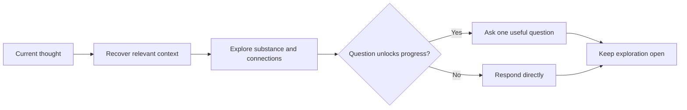

# 💬 Think Discuss

**Use when:** The user wants a thinking partner without a forced outcome.
**Default binding:** The thought currently being expressed.
**Accepts:** A compatible HACP Working Object or the declared default material.
**Effect:** Develop its implications, connections, tensions, language, or examples.
**Result:** A direct response that develops the thought while preserving useful ambiguity.
**Duration:** One agent turn. Play it again whenever exploration should continue.
**Limits:** Ask only when a question unlocks the discussion. Do not become an interview, grill, recap, proposal, plan, or artifact.

## Flow

## Format

Begin the combo trace with `> 🎯 **<binding>** → 💬 **DISCUSS**`, then respond naturally without forced section headings.

Add later operation cards or an output with `→` and presentation cards with `+`; show the trace once for the complete combo.
