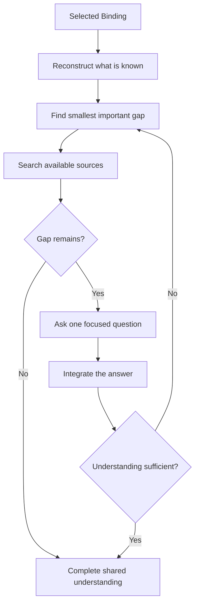

# 🔎 Think Interview

**Use when:** Important missing information prevents shared understanding.
**Default binding:** The smallest current subject with important missing information.
**Accepts:** A compatible HACP Working Object or the declared default material.
**Effect:** Resolve discoverable facts, ask one focused question at a time, and adapt each question to the preceding answer.
**Result:** Enough shared understanding to continue without guessing.
**Duration:** Multiple exchanges. Keep the selected Binding until understanding is sufficient or the user stops, redirects, or plays another card.
**Limits:** Stay neutral. Do not challenge, recommend, or turn the interview into a grill.

## Flow

## Format

At launch, show the full trace: `> 🎯 **<binding>** → 🔎 **INTERVIEW**`. On later turns, show `> 🔎 **INTERVIEW** · <binding>`.

Show `Question`. Add `Why it matters` only when the reason is unclear. At completion, state the shared understanding without a recommendation.
