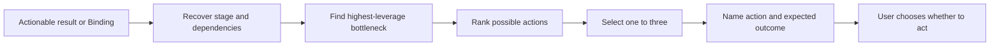

# ⚡ Think Next

**Use when:** The user has enough clarity to continue but needs the highest-leverage next step.
**Default binding:** The latest actionable result, otherwise the current Binding.
**Accepts:** A compatible HACP Working Object or the declared default material.
**Effect:** Recover the current stage and dependencies, identify the bottleneck, then rank concrete actions by leverage.
**Result:** One to three actions with expected outcomes.
**Duration:** One agent turn.
**Limits:** Distinguish conversational and external actions. Do not expand into a full plan or execute anything.

## Flow

Prefer a reversible learning step when uncertainty is high.

## Format

Begin the combo trace with `> 🎯 **<binding>** → ⚡ **NEXT**`, followed by one to three `Next actions` ordered by leverage.

Add an output with `→` and presentation cards with `+`; show the trace once for the complete combo.
