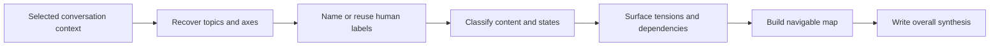

# 🗺️ Think Recap

**Use when:** The discussion has lost its overall shape or needs a checkpoint.
**Default binding:** The full available conversation, the same Binding as `/on-conversation`.
**Accepts:** A compatible HACP Working Object or the declared default material.
**Effect:** Reconstruct topics and axes with concise human labels, reuse supported labels, classify their contents and states, then synthesize relationships across them.
**Result:** A navigable map whose topic and axis labels can be reused by binding cards, followed by a coherent account of where the thinking stands.
**Duration:** One agent turn. Play it again at useful checkpoints.
**Limits:** Preserve uncertainty and disagreement. Do not suggest another command, choose a direction, decide, plan, create technical identifiers, persist state, or create a file.

## Flow

## Format

Begin the combo trace with `> 🎯 **<binding>** → 🗺️ **RECAP**`, followed by `Map` and `Digest`. Show the `Conversation → Topics → Axes` tree and the state of each axis. Give every topic and axis a concise label the user can repeat with `on-topic` or `on-axis`.

Add an output with `→` and presentation cards with `+`. Do not append suggested commands.
