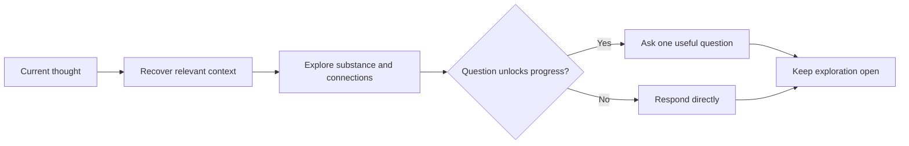

# 💬 Think Discuss

**Context:** The full relevant conversation and explicitly supplied material.
**Use when:** The user wants a thinking partner without a forced outcome.
**Applies to by default:** The thought currently being expressed.
**Job:** Develop its implications, connections, tensions, language, or examples.
**Result:** A direct response that develops the thought while preserving useful ambiguity.
**Runs for:** One response; repeat whenever exploration should continue.
**Limits:** Ask only when a question unlocks the discussion. Do not become an interview, grill, recap, proposal, plan, or artifact.
**Combines with:** Work on a selected focus or the preceding job's result, then pass the response to later cards.

## Flow

## Format

Begin the combo trace with `> 🎯 **<focus>** → 💬 **DISCUSS**`, then respond naturally without forced section headings.

Add later jobs or an output with `→` and modifiers with `+`; show the trace once for the complete combo.
