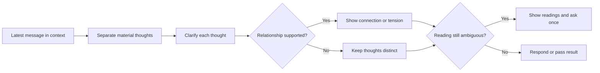

# 🧪 Think Distill

**Context:** The full relevant conversation and explicitly supplied material.
**Use when:** Ideas arrive faster than the user can structure them.
**Applies to by default:** The latest human message, interpreted in its relevant context.
**Job:** Separate every material thought, clarify each one, then expose only convergence, tension, or dependency supported by the context.
**Result:** Clear thoughts that preserve the user's meaning, ambiguity, and distinctions.
**Runs for:** One response; useful on successive messages.
**Limits:** Do not merge distinct thoughts, invent connections, place advice inside the distillation, or replace clarification with another job.
**Combines with:** Alone, respond after distilling. In a combo, pass the structured result to the next job without an intermediate answer.

## Flow

## Format

Begin the combo trace with `> 🎯 **<focus>** → 🧪 **DISTILL**`, then use:

1. `Distilled` with one formulation or a short list.
2. `Connections` only when the context supports them.
3. `Response` when used alone.

Keep implications and advice in `Response`. Add later jobs with `→`; show the trace once for the complete combo.
