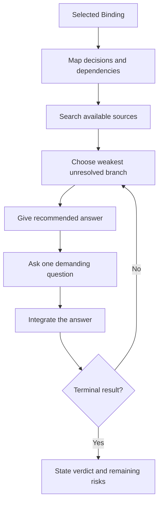

# 🔥 Think Grill

**Use when:** A testable idea needs pressure before the user relies on it.
**Default binding:** The current proposal, assumption, decision, design, or plan.
**Accepts:** A compatible HACP Working Object or the declared default material.
**Effect:** Walk its decision tree, resolve discoverable facts, then test one unresolved branch at a time with a recommendation and demanding question.
**Result:** A selected idea that survives the grill, is rejected, or is reduced to explicit risks.
**Duration:** Multiple exchanges. Keep the selected Binding until a result is reached or the user stops, redirects, or plays another card.
**Limits:** Separate fact, inference, and unresolved claim. Do not decide for the user or ask for information that can be found from available sources.

## Flow

## Format

At launch, show the full trace: `> 🎯 **<binding>** → 🔥 **GRILL**`. On later turns, show `> 🔥 **GRILL** · <binding>`.

Show `Recommendation`, then `Question`. At completion, show `Verdict` and any remaining risks.
