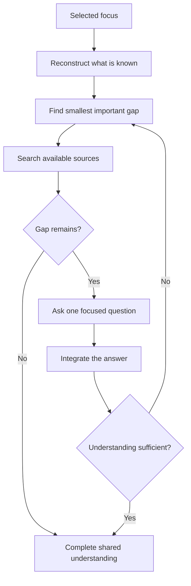

# 🔎 Think Interview

**Context:** The full relevant conversation and explicitly supplied material.
**Use when:** Important missing information prevents shared understanding.
**Applies to by default:** The smallest current subject with important missing information.
**Job:** Resolve discoverable facts, ask one focused question at a time, and adapt each question to the preceding answer.
**Result:** Enough shared understanding to continue without guessing.
**Runs for:** Multiple turns. Keep the selected focus until understanding is sufficient or the user stops, redirects, or invokes another command.
**Limits:** Stay neutral. Do not challenge, recommend, or turn the interview into a grill.
**Combines with:** A selector applies the focus for the full interview. Modifiers can represent the final understanding without changing it.

## Flow

## Format

At launch, show the full trace: `> 🎯 **<focus>** → 🔎 **INTERVIEW**`. On later turns, show `> 🔎 **INTERVIEW** · <focus>`.

Show `Question`. Add `Why it matters` only when the reason is unclear. At completion, state the shared understanding without a recommendation.
