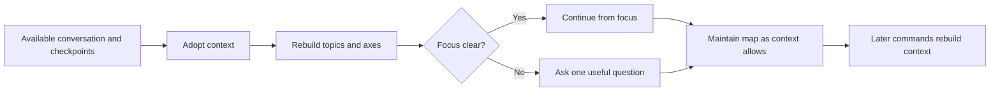

# 🧩 Think It Through

**Context:** The full available conversation and explicitly supplied material, including a brief or other checkpoint.
**Use when:** A conversation has become substantial, including when activation comes late or a supplied checkpoint should restart the thinking.
**Applies to by default:** The current focus or supplied subject; adoption remains conversation-wide.
**Job:** Adopt the available context, rebuild `Conversation → Topics → Axes` with stable human labels and supported states, then maintain that map as the available context allows.
**Result:** An adopted session with a resolved focus and quiet continuity.
**Runs for:** One activation, with the map maintained silently until context is lost or the session ends.
**Limits:** Do not suggest a command unless asked how to continue, apply one silently, claim access to discarded context, or promise memory or synchronization across sessions.
**Combines with:** Standalone. Later commands rebuild their relevant context; selectors can focus a combo without reducing the adopted conversation.

## Flow

## Format

Respond only:

`> 🧩 **THINK IT THROUGH** · Adopted: available conversation and supplied checkpoints · Current: <focus>`
