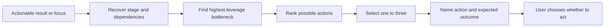

# ⚡ Think Next

**Context:** The full relevant conversation and explicitly supplied material.
**Use when:** The user has enough clarity to continue but needs the highest-leverage next step.
**Applies to by default:** The latest actionable result, otherwise the current focus.
**Job:** Recover the current stage and dependencies, identify the bottleneck, then rank concrete actions by leverage.
**Result:** One to three actions with expected outcomes.
**Runs for:** One response.
**Limits:** Distinguish conversational and external actions. Do not expand into a full plan or execute anything.
**Combines with:** Work on the latest result or a selected focus. An output can turn an accepted direction into a plan.

## Flow

Prefer a reversible learning step when uncertainty is high.

## Format

Begin the combo trace with `> 🎯 **<focus>** → ⚡ **NEXT**`, followed by one to three `Next actions` ordered by leverage.

Add an output with `→` and modifiers with `+`; show the trace once for the complete combo.
