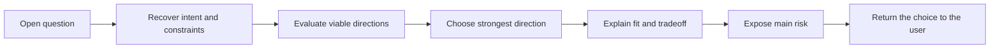

# 🧭 Think Propose

**Use when:** Exploration has produced an open question that needs direction.
**Default binding:** The current open question or decision.
**Accepts:** A compatible HACP Working Object or the declared default material.
**Effect:** Evaluate viable directions, choose one, and expose why it fits, what it gives up, and where it can fail.
**Result:** One strong proposal that the user can accept, reject, or refine.
**Duration:** One agent turn.
**Limits:** Do not hide the decisive tradeoff, offer a soft menu, make the final decision, or continue into planning.

## Flow

If the user requests a lateral direction, choose one that changes the structure rather than the wording.

## Format

Begin the combo trace with `> 🎯 **<binding>** → 🧭 **PROPOSE**`, followed by `Direction`, `Why`, `Tradeoff`, `Main risk`, and `Your call`.

Add later operation cards or an output with `→` and presentation cards with `+`; show the trace once for the complete combo.
