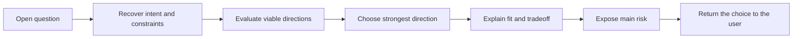

# 🧭 Think Propose

**Context:** The full relevant conversation and explicitly supplied material.
**Use when:** Exploration has produced an open question that needs direction.
**Applies to by default:** The current open question or decision.
**Job:** Evaluate viable directions, choose one, and expose why it fits, what it gives up, and where it can fail.
**Result:** One strong proposal that the user can accept, reject, or refine.
**Runs for:** One response.
**Limits:** Do not hide the decisive tradeoff, offer a soft menu, make the final decision, or continue into planning.
**Combines with:** Work on a selected focus or the preceding job's result. Pass the proposal to another job, an output, or modifiers.

## Flow

If the user requests a lateral direction, choose one that changes the structure rather than the wording.

## Format

Begin the combo trace with `> 🎯 **<focus>** → 🧭 **PROPOSE**`, followed by `Direction`, `Why`, `Tradeoff`, `Main risk`, and `Your call`.

Add later jobs or an output with `→` and modifiers with `+`; show the trace once for the complete combo.
