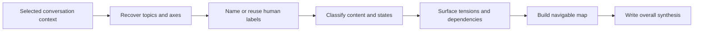

# 🗺️ Think Recap

**Context:** The full relevant conversation and explicitly supplied material.
**Use when:** The discussion has lost its overall shape or needs a checkpoint.
**Applies to by default:** The full available conversation, the same focus as `/think-on-conversation`.
**Job:** Reconstruct topics and axes with concise human labels, reuse supported labels, classify their contents and states, then synthesize relationships across them.
**Result:** A navigable map whose topic and axis labels can be reused by selectors, followed by a coherent account of where the thinking stands.
**Runs for:** One response; repeat at useful checkpoints.
**Limits:** Preserve uncertainty and disagreement. Do not suggest another command, choose a direction, decide, plan, create technical identifiers, persist state, or create a file.
**Combines with:** A selector can narrow the focus. A modifier changes the final representation. `think-to-brief` can preserve this explicit checkpoint. The default resolves directly; it does not run a hidden selector.

## Flow

## Format

Begin the combo trace with `> 🎯 **<focus>** → 🗺️ **RECAP**`, followed by `Map` and `Digest`. Give each topic and axis a concise label the user can repeat with `think-on-topic` or `think-on-axis`.

Add an output with `→` and modifiers with `+`. Do not append suggested commands.
