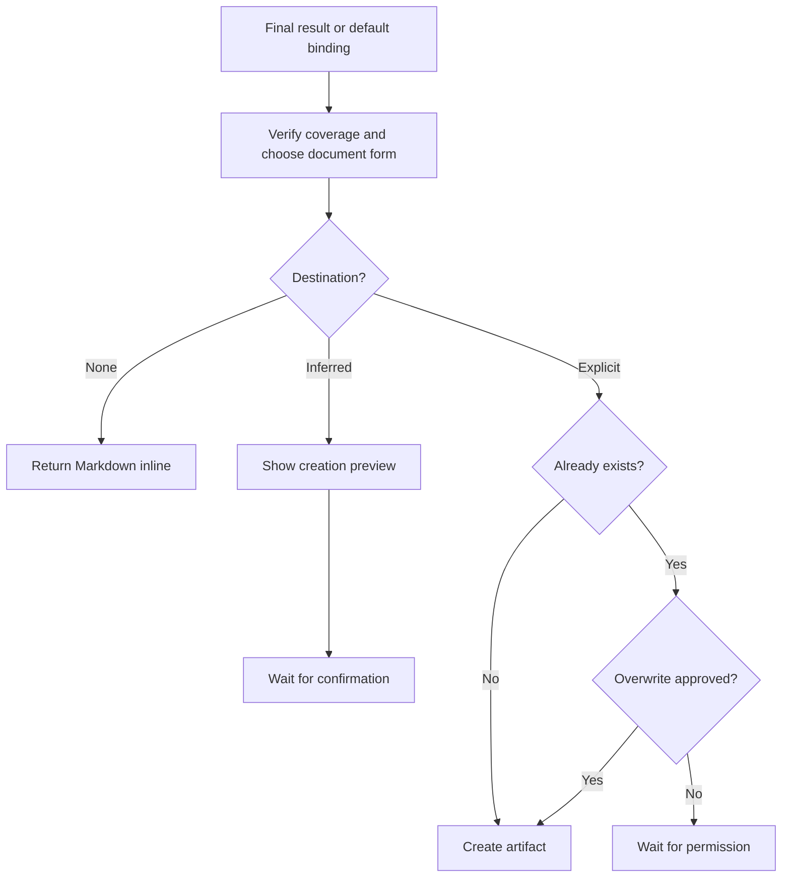

# 📄 Think To Brief

**Use when:** The user wants to preserve thinking for reuse in this session, another session, or another tool.
**Default binding:** The full available conversation, the same Binding as `/think-on-conversation` when used alone. A result supplied by a combo takes priority.
**Accepts:** A compatible HACP Working Object or the declared default material.
**Effect:** Use the canonical map or supplied result to verify coverage, infer a useful document form and audience, then use the subject's vocabulary and the audience's expected structure.
**Result:** A portable Markdown checkpoint that covers the relevant material, with purpose, overall synthesis, decisions, tensions, open questions, and where to resume when useful.
**Duration:** One output flow, including any required confirmation.
**Limits:** Keep the trace, HACP, cards, combos, and deck vocabulary outside the artifact body unless they are the subject or the user requests them. Do not run an implicit recap, invent conclusions, claim cross-session memory, synchronize later, or overwrite without permission.

## Flow

Follow an applicable method or project convention; otherwise use portable Markdown. A creation preview states the overview, outline, inclusions, exclusions, and proposed path.

## Format

Add `→ 📄 **BRIEF**` after the final move in the combo trace, or begin with `> 🎯 **<binding>** → 📄 **BRIEF**` when used alone. Add presentation cards with `+`.

Keep that trace in the conversational envelope, outside the brief. Show status only while awaiting confirmation or overwrite permission. A later session resumes only when the user supplies the brief or its content.
