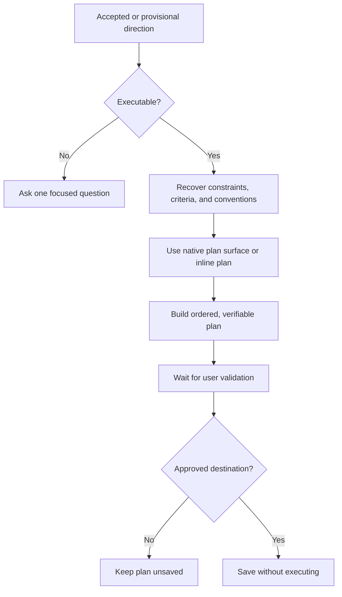

# 📋 Think To Plan

**Context:** The full relevant conversation and explicitly supplied material.
**Use when:** An accepted or explicitly provisional direction needs operational structure.
**Applies to by default:** The accepted or explicitly provisional executable direction.
**Job:** Use the canonical map and source direction to recover constraints, success criteria, and applicable conventions, then produce an ordered, verifiable Execution Plan on the agent's native planning surface when available.
**Result:** A proposed plan with objective, ordered work, dependencies, risks, verification, and completion criteria.
**Runs for:** One output followed by user validation.
**Limits:** Keep the trace and protocol vocabulary outside the artifact body unless Think It Through is the subject or the user requests them. Ask once when no executable direction exists. Do not fabricate details, treat the plan as approval, execute it, save it without an approved destination, or overwrite without permission.
**Combines with:** Consume the final job result or an accepted selected direction. Modifiers apply to the resulting plan. Ask one clarification if another output appears in the combo.

## Flow

State whether the source direction is accepted or provisional.

## Format

Add `→ 📋 **PLAN**` after the final job in the combo trace, or begin with `> 🎯 **<focus>** → 📋 **PLAN**` when used alone. Add modifiers with `+`.

Keep that trace in the conversational envelope, outside the plan. Show status while awaiting direction, validation, destination, or overwrite permission. A plan never authorizes execution.
