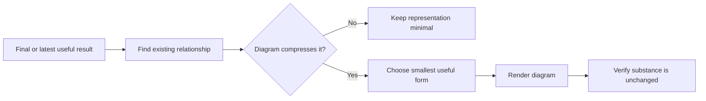

# 📊 Think With Diagrams

**Context:** The full relevant conversation and explicitly supplied material.
**Use when:** Existing relationships would be easier to understand as a visual structure.
**Applies to by default:** The final result from the same combo, otherwise the latest substantive result or focus.
**Job:** Identify the relationship worth compressing, choose the smallest useful form, and represent it without changing the substance.
**Result:** A flow, tree, timeline, matrix, table, or Mermaid diagram tied to the existing content.
**Runs for:** One response; does not affect later responses.
**Limits:** Do not decorate, duplicate prose, remove qualifications, or add conclusions, decisions, or certainty. Say briefly when a diagram would not help.
**Combines with:** Apply to the final substantive result or artifact. Multiple modifiers read that same result; they do not transform one another.

## Flow

## Format

Append `+ 📊 **DIAGRAMS**` to the complete combo trace. Used alone, begin with `> 🎯 **<focus>** + 📊 **DIAGRAMS**`.

Place each diagram beside the content it clarifies.
