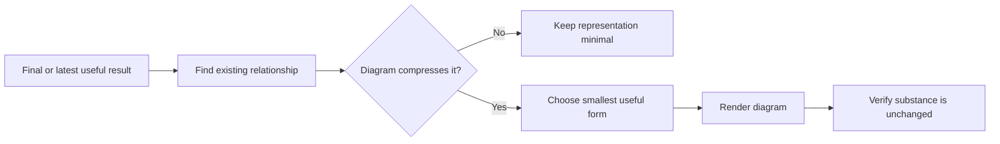

# 📊 Think With Diagrams

**Use when:** Existing relationships would be easier to understand as a visual structure.
**Default binding:** The final result from the same combo, otherwise the latest substantive result or Binding.
**Accepts:** A compatible HACP Working Object or the declared default material.
**Effect:** Identify the relationship worth compressing, choose the smallest useful form, and represent it without changing the substance.
**Result:** A flow, tree, timeline, matrix, table, or Mermaid diagram tied to the existing content.
**Duration:** One final representation. It does not affect later responses.
**Limits:** Do not decorate, duplicate prose, remove qualifications, or add conclusions, decisions, or certainty. Say briefly when a diagram would not help.

## Flow

## Format

Append `+ 📊 **DIAGRAMS**` to the complete combo trace. Used alone, begin with `> 🎯 **<binding>** + 📊 **DIAGRAMS**`.

Place each diagram beside the content it clarifies.
