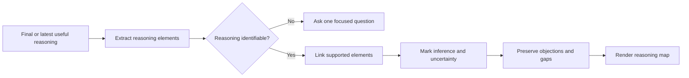

# 🧠 Think With Reasoning Map

**Context:** The full relevant conversation and explicitly supplied material.
**Use when:** The user needs to inspect how a claim, proposal, decision, or system holds together.
**Applies to by default:** The final reasoning from the same combo, otherwise the current proposal or decision.
**Job:** Extract stated claims, evidence, premises, assumptions, inferences, implications, and objections, then map supported links.
**Result:** An argument map for a claim or a broader reasoning map for a decision or system.
**Runs for:** One response; does not affect later responses.
**Limits:** Mark inferred links and uncertainty. Do not add or repair evidence, causality, confidence, or reasoning. Do not challenge or decide.
**Combines with:** Apply to the final substantive result or artifact. Multiple modifiers read that same result; they do not transform one another.

## Flow

## Format

Append `+ 🧠 **REASONING MAP**` to the complete combo trace. Used alone, begin with `> 🎯 **<focus>** + 🧠 **REASONING MAP**`.

Use labels that distinguish claims, evidence, assumptions, inferences, and objections.
