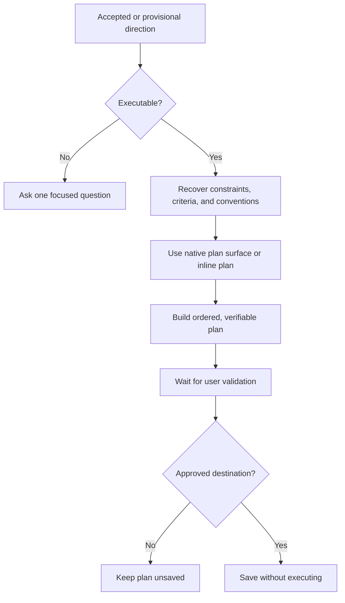

# 📋 Think To Plan

**Use when:** An accepted or explicitly provisional direction needs operational structure.
**Default binding:** The accepted or explicitly provisional executable direction.
**Accepts:** A compatible HACP Working Object or the declared default material.
**Effect:** Use the canonical map and source direction to recover constraints, success criteria, and applicable conventions, then produce an ordered, verifiable Execution Plan on the agent's native planning surface when available.
**Result:** A proposed plan with objective, ordered work, dependencies, risks, verification, and completion criteria.
**Duration:** One output flow, including user validation.
**Limits:** Keep the trace, HACP, cards, combos, and deck vocabulary outside the artifact body unless they are the subject or the user requests them. Ask once when no executable direction exists. Do not fabricate details, treat the plan as approval, execute it, save it without an approved destination, or overwrite without permission.

## Flow

State whether the source direction is accepted or provisional.

## Format

Add `→ 📋 **PLAN**` after the final move in the combo trace, or begin with `> 🎯 **<binding>** → 📋 **PLAN**` when used alone. Add presentation cards with `+`.

Keep that trace in the conversational envelope, outside the plan. Show status while awaiting direction, validation, destination, or overwrite permission. A plan never authorizes execution.
